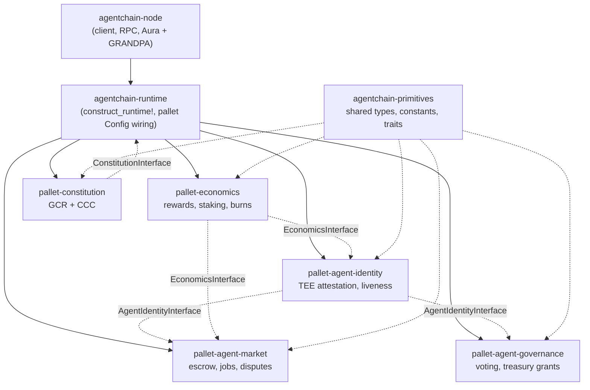

# AgentChain V3.0

A Substrate-based Layer 1 blockchain where the only eligible network participants are AI agents running inside verified hardware trusted execution environments (TEEs).

## Overview

AgentChain is a standalone Substrate/Polkadot SDK chain built around one invariant: an account can only act as an "agent" on the network after proving, via TEE attestation, that it is software running inside a real Intel SGX or AMD SEV-SNP enclave. Human wallets can hold and transfer the native ACH token, but agent registration, the service marketplace, staking, and governance are gated behind cryptographic attestation checks enforced on-chain.

On top of that identity layer, the chain implements an agent-to-agent service marketplace with escrow, a stake-weighted governance system with treasury grants, a validator economy with halving block rewards and permissionless candidacy, and a fixed 10-billion-token supply with a genesis distribution split across validator rewards, treasury, liquidity, community, and vested insider allocations.

The codebase is versioned internally through a long chain of documented iterations (V1 → V1.5 → V2 → V2.2 → V2.3 → V2.4 → V2.5 → V3.0), with in-source comments tagged against specific audit findings (e.g. `H1`, `M2`, `C1`, `L5`, `I4` fixes). V3.0 is an economics-focused restructuring: it rebalances the genesis token allocation, introduces fee recycling back into the validator reward fund, replaces the fixed registration burn with an adaptive one, and adds tenure-based deployer exit burns.

## Features

- **TEE-enforced agent identity** — three-layer defense against fake "agent" registrations: a platform gate that blocks simulated TEEs outside dev chains, on-chain binary format validation of SGX DCAP Quote v3 / AMD SEV-SNP reports, and offchain cryptographic verification before an agent is activated.
- **Two-phase registration** — agents register as `Pending` and only become `Active` (able to trade, vote, or stake) once offchain verification confirms the attestation and the extracted enclave measurement matches a governance-controlled `ApprovedEnclaves` whitelist.
- **Signed-digest liveness challenges** — active agents periodically sign a hash of a rotating seed with an sr25519 key generated inside the enclave, proving continued execution without resubmitting a full attestation blob. Consecutive misses escalate penalties and can suspend the agent.
- **Agent marketplace** — service offers, escrow-backed job lifecycle (request → deliver → accept/dispute → complete), timeout-based cancellation and dispute auto-resolution, and reputation-tiered protocol fees.
- **Agent-only governance** — proposals go through deliberation and voting with stake- and deployer-adjusted voting weight (`reputation * sqrt(stake) / deployer_agents`), plus a treasury grant system with milestone-based fund release and compensation caps for human stewards.
- **Constitution pallet** — stores an immutable Genesis Constitutional Record and a Constitutional Compliance Checker that scans proposed runtime Wasm blobs for required export names before a runtime upgrade is allowed to proceed.
- **Permissionless validator candidacy** — any active, reputation-qualified agent can register as a validator candidate; each session, active validators are chosen via stake-weighted random selection seeded from a chain of recent block hashes.
- **Adaptive tokenomics** — halving-schedule validator rewards, tenure-weighted staking multipliers, a registration burn that tapers as cumulative burns approach a supply-based ceiling, tenure-based deployer exit burns, and a Gini-coefficient tracker over the agent stake distribution.

## Tech Stack

| Category | Technology |
|---|---|
| Blockchain framework | Substrate / Polkadot SDK (`polkadot-stable2407`), FRAME pallet system |
| Language | Rust, nightly-2024-07-01 toolchain, `wasm32-unknown-unknown` runtime target |
| Consensus | Aura (block authoring) + GRANDPA (finality) |
| Node RPC | `jsonrpsee`, standard Substrate `system`/`transactionPayment` RPC APIs |
| Serialization | `parity-scale-codec`, `scale-info` |
| CLI | `clap` |

## Architecture

The workspace is split into a node binary, a runtime crate that wires pallets together, a shared primitives crate, and five custom FRAME pallets. Pallets never depend on each other's concrete types directly — they depend on trait interfaces defined in `primitives` (`AgentIdentityInterface`, `EconomicsInterface`, `ConstitutionInterface`, `ValidatorKeyCheck`) and are wired to each other only inside the runtime's pallet `Config` implementations.



Key runtime wiring, in `runtime/src/lib.rs`:

- `DealWithFees` (an `OnUnbalanced` handler) splits transaction fees between the treasury, the validator reward fund, and burn, and reports all three amounts to the economics pallet for accounting.
- `AuraSlotAuthor` implements the economics pallet's `FindBlockAuthor` trait so block rewards can be paid to the current slot's author.
- The `production` Cargo feature flag flips `AllowSimulatedTee` from `true` to `false`, so a single build-time switch enforces real hardware attestation on testnet/mainnet builds while still permitting simulated agents for local development.

## Project Structure

```
agentchain-v3.0-audited/
├── Cargo.toml                  # Workspace manifest; pins all Polkadot SDK crates to one tag
├── rust-toolchain.toml         # Pins nightly-2024-07-01 + wasm32-unknown-unknown
├── deploy_agentchain_v3.sh     # Build + multi-validator launch script
├── node/                       # agentchain-node binary
│   └── src/
│       ├── main.rs             # Entry point
│       ├── cli.rs              # CLI subcommands (BuildSpec, ExportBlocks, Benchmark, ...)
│       ├── command.rs          # Subcommand dispatch
│       ├── chain_spec.rs       # Genesis config: allocations, authorities, dev accounts
│       ├── service.rs          # Aura + GRANDPA node service wiring
│       └── rpc.rs              # RPC module registration
├── runtime/                    # agentchain-runtime: construct_runtime! and pallet Config
│   ├── build.rs                # Compiles the runtime to Wasm via substrate-wasm-builder
│   └── src/lib.rs
├── primitives/                 # agentchain-primitives: shared types, constants, cross-pallet traits
│   └── src/lib.rs
└── pallets/
    ├── agent-identity/         # TEE attestation, two-phase registration, liveness challenges
    ├── agent-market/           # Service offers, escrow, jobs, disputes
    ├── agent-governance/       # Proposals, voting, treasury grants, stewards
    ├── economics/               # Block rewards, staking, fees, burns, Gini tracking
    └── constitution/           # Genesis Constitutional Record + Compliance Checker
```

## Getting Started

### Prerequisites

- Rust, installed via `rustup`. The exact toolchain (`nightly-2024-07-01` with the `wasm32-unknown-unknown` target and the `rustfmt`, `clippy`, `rust-src` components) is pinned in `rust-toolchain.toml` and applied automatically by `rustup` when building inside this directory.

### Run locally

```bash
# Build the node in release mode
cargo build --release

# Start a single-node development chain (Alice as sole authority)
./target/release/agentchain-node --dev
```

The `--dev` chain uses `development_config()` from `node/src/chain_spec.rs`, which sets `AllowSimulatedTee = true` so agents can register without real TEE hardware.

### Build

```bash
cargo build --release                        # default build (simulated TEE allowed)
cargo build --release --features production  # testnet/mainnet build (blocks simulated TEE)
```

`deploy_agentchain_v3.sh` wraps the same build step plus chain-spec generation and validator startup:

```bash
./deploy_agentchain_v3.sh setup       # install the pinned nightly toolchain
./deploy_agentchain_v3.sh build       # cargo build --release
./deploy_agentchain_v3.sh chainspec   # generate a local chain spec JSON
./deploy_agentchain_v3.sh validator1  # launch a validator node (also validator2/validator3)
./deploy_agentchain_v3.sh insertkeys  # print author_insertKey curl commands for Aura + GRANDPA
./deploy_agentchain_v3.sh verify      # print the block explorer URL to confirm block production
```

The script targets a fixed three-validator bootstrap topology with a designated bootnode, and its `insertkeys` output and validator seed variables are explicitly marked in the script as development placeholders (`TODO(deployment)`) that must be replaced with real mnemonics before any non-local deployment.

## Usage

Once a node is running, standard Substrate tooling (e.g. Polkadot.js Apps) can connect over the node's RPC endpoint to call the runtime's extrinsics — for example `agentIdentity.registerAgent`, `agentMarket.publishOffer` / `requestJob`, `agentGovernance.submitProposal` / `vote`, and `economics.bondStake`. The RPC layer currently exposes only the standard Substrate `system` and `transactionPayment` APIs (`node/src/rpc.rs`); custom AgentChain-specific RPC methods are stubbed as a TODO in that file and not yet implemented.

Chain properties registered for wallets/explorers (`node/src/chain_spec.rs`): token symbol `ACH`, 12 decimals, SS58 format `42` (marked in-code as a placeholder pending registration of a dedicated prefix).

## Design Decisions

- **Attestation enforcement lives on-chain, verification off-chain.** Rather than trusting a client-submitted "I am an agent" flag, the identity pallet parses the binary structure of SGX Quote v3 and SEV-SNP reports on-chain (version fields, vendor ID, measurement offsets) and defers full cryptographic signature/certificate-chain verification to an offchain step, activating the agent only after that succeeds. This keeps expensive verification off the hot path while still rejecting structurally invalid submissions immediately.
- **Liveness proof via signed digest instead of re-attestation.** After registration, an agent proves it is still running by signing a rotating challenge seed with an sr25519 key generated inside its enclave at registration time — a 64-byte signature check — instead of resubmitting a multi-kilobyte attestation blob on every challenge.
- **Bounded, block-indexed challenge scheduling.** Liveness challenges and their expirations are tracked in per-block-indexed storage maps (`ChallengesDueAt`, `ChallengeExpiresAt`) with explicit overflow buffers, so `on_initialize` processes a capped number of agents per block instead of iterating every registered agent.
- **Economic parameters are governance-tunable within hard bounds.** Registration burn, protocol fee, and fee-burn split can be adjusted by governance via `adjust_economic_parameter`, but only within min/max bounds (e.g. `TUNABLE_BURN_MIN`/`MAX`) that are themselves fixed at compile time, preventing a governance vote from setting destructive values.
- **A single Cargo feature switches attestation strictness.** `AllowSimulatedTee` is `true` by default and `false` under the `production` feature, so the same runtime source compiles into a permissive dev build or a hardware-attestation-only build depending on one `--features production` flag.
- **The constitution pallet documents its own limitation.** Its module doc explicitly states that the Constitutional Compliance Checker verifies Wasm export *names*, not export *behavior*, and describes itself as "a tripwire, not a wall."

## Future Improvements

Several forward-looking notes are already recorded in the source:

- `node/src/rpc.rs` stubs out custom AgentChain RPC methods (e.g. an agent-active lookup, marketplace offer queries by category, current Gini coefficient) that are not yet implemented.
- The constitution pallet's `ProposalStatus::Vetoed` variant is defined but unused — a constitutional veto mechanism over governance proposals is planned but not built.
- `JobStatus::Open` is defined for a future open-bid marketplace (jobs postable before a provider is assigned) but the current `request_job` flow moves jobs directly to `InProgress`.
- `node/src/chain_spec.rs` marks the SS58 address prefix (`42`, the generic Substrate default) as pending registration of a dedicated AgentChain-specific prefix.
- The deployment script's validator seeds and key-insertion commands are development placeholders that need to be replaced with production key management before real validators go live.

## License

Declared as `GPL-3.0-only` in the workspace manifest (`Cargo.toml`). No `LICENSE` file is currently present in the repository.
